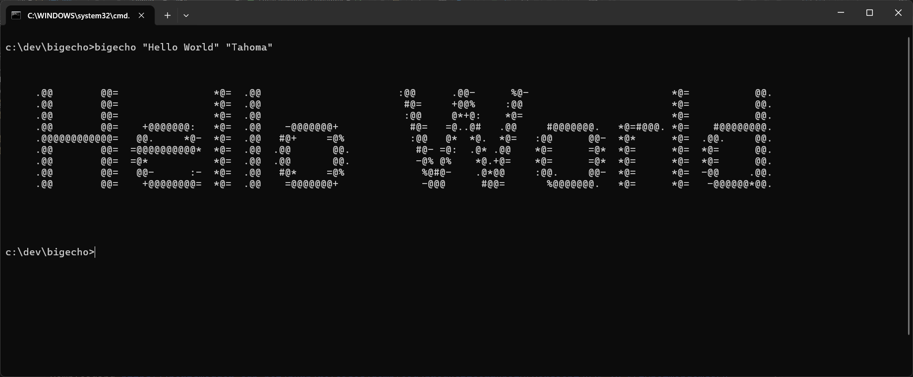
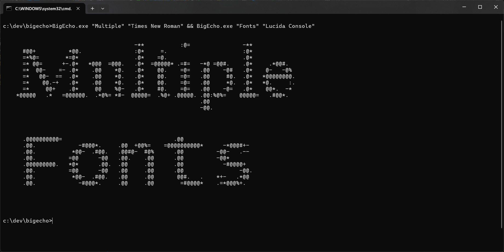

# BigEcho

Once upon a time, in the old DOS days, there used to be a utility called BigEcho that I used repeatedly
to create banners for BBS ansi and ascii screens.

This is a variant of that utility, that compiles under Windows and can utilize the installed fonts
of the local machine to draw and convert them to ascii banners.

You can also call it multiple times to create screens with different fonts.

